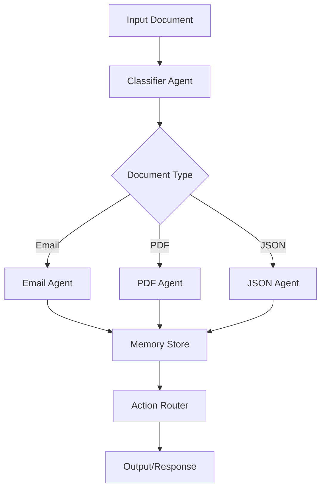

# multi-agent-system
Multi-Format Autonomous AI System with Contextual Decisioning &amp; Chained Actions
=======
# Flowbit - Intelligent Document Processing Pipeline

## Overview

Flowbit is an intelligent agent-based system for processing and routing different types of documents (emails, PDFs, JSON) through specialized processing pipelines. The system uses a classification agent to determine document type and routes them to appropriate specialized agents for handling.

## Architecture

### Core Components

1. **Classification Agent** (`agents/classifier_agent.py`)

   - Determines document type
   - Routes to appropriate specialized agent

2. **Specialized Agents**

   - Email Agent (`agents/email_agent.py`)
   - PDF Agent (`agents/pdf_agent.py`)
   - JSON Agent (`agents/json_agent.py`)

3. **Memory System** (`memory/memory_store.py`)

   - SQLite-based persistent storage
   - Tracks document processing history
   - Maintains agent state

4. **Action Router** (`mcp/action_router.py`)
   - Manages agent workflow
   - Handles inter-agent communication
   - Orchestrates processing pipeline

## Agent Flow Diagram



## Sample Inputs

### Email Samples

- Complaint Email (`data/email1_complaint.txt`)
- Request for Quote (`data/email2_RFQ.txt`)
- Invoice Email (`data/email3_Invoice.txt`)

### PDF Samples

- Standard Invoice (`data/sample-invoice.pdf`)
- WordPress Invoice (`data/wordpress-pdf-invoice-plugin-sample.pdf`)

### JSON Samples

- Payment Success (`data/json1_Payment_Success.json`)
- Customer Complaint (`data/json2_complaint.json`)
- Invoice Data (`data/json3_Invoice.json`)

## Setup

1. Clone the repository

```bash
git clone https://github.com/yourusername/flowbit.git
```

2. Install dependencies

```bash
pip install -r requirements.txt
```

3. Configure environment variables

```bash
cp .env.example .env
# Edit .env with your configurations
```

4. Run the system

```bash
python main.py
```

## Output Logs

The system generates detailed logs for each processing stage:

- Document classification results
- Agent processing steps
- Memory store operations
- Action routing decisions

Example log output:

```
2025-06-05 10:30:15 INFO: Received document: email1_complaint.txt
2025-06-05 10:30:15 INFO: Classified as: EMAIL
2025-06-05 10:30:16 INFO: Routing to: EmailAgent
2025-06-05 10:30:16 INFO: Processing complete - stored in memory
```

## Post-Processing Results

- Classification accuracy metrics
- Processing time statistics
- Action success rates
- Memory storage efficiency

## Contributing

1. Fork the repository
2. Create feature branch (`git checkout -b feature/AmazingFeature`)
3. Commit changes (`git commit -m 'Add AmazingFeature'`)
4. Push to branch (`git push origin feature/AmazingFeature`)
5. Open Pull Request

## License

MIT License - see LICENSE file for details
>>>>>>> ac1a43d (Initial commit: Flowbit)
